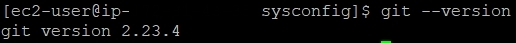
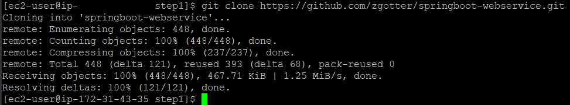
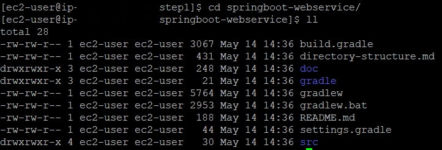
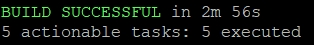

# EC2에 프로젝트 Clone 받기

## 1. git 설치 및 버전 확인

```
sudo yum install git
```

```
git --version
```



<br>

## 2. git clone으로 프로젝트를 저장할 디렉토리 생성

```
mkdir ~/app && ~/app/step1
```

<br>

## 3. 생성된 디렉토리로 이동

```
cd ~/app/step1
```

<br>

## 4. git clone

```
git clone 깃허브 repository 주소
```



<br>

## 5. clone 성공 확인

```
cd 프로젝트명
ll
```



<br>

## 6. 테스트 검증

- 현재 EC2엔 그레이들(Gradle)을 설치하지 않았다.
- 하지만 Gradle Task(ex. test)를 수행할 수 있다.
- 이는 프로젝트 내부에 포함된 `gradlew` 파일 때문이다.
- `gradlew`
  - 그레이들이 설치되지 않은 환경 혹은 버전이 다른 상황에서도 해당 프로젝트에 한해서 그레이들을 쓸 수 있도록 지원하는 Wrapper 파일
- 해당 파일을 직접 이용하기 때문에 별도로 설치할 필요가 없다.

### 6.1 명령어 실행 권한 추가

```
chmod +x ./gradlew
```

<br>

### 6.2 테스트 검증 실행

```
./gradlew test
```



<br>

## 7. 변경 사항 반영

- 테스트가 실패해서 수정하고 깃허브에 푸시를 한 경우 프로젝트 폴더 안에서 다음 명령어를 사용

```
cd ~/app/step1/프로젝트명
git pull
```