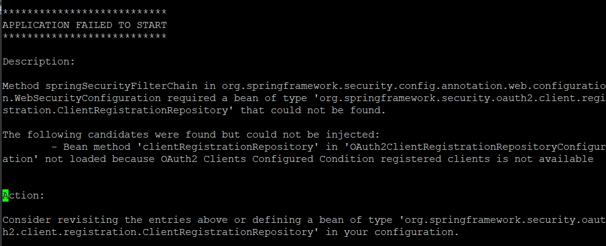
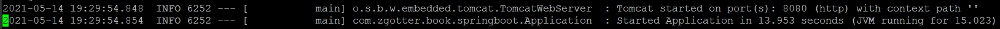

# 배포 스크립트 생성

## 1. 배포란?

- 작성한 코드를 실제 서버에 반영하는 것
- 해당 프로젝트에서의 배포란 다음의 과정을 모두 포괄하는 의미이다.
  - git clone 혹은 git pull을 통해 새 버전의 프로젝트 받음
  - Gradle이나 Maven을 통해 프로젝트 테스트 및 빌드
  - EC2 서버에서 해당 프로젝트 실행 및 재실행

<br>

## 2. 배포 스크립트

- 위 과정들을 배포할 때마다 개발자가 하나하나 명령어를 실행하는 것은 불편함이 많다.
- 이를 쉘 스크립트로 작성해 스크립트만 실행하면 앞의 과정이 차례로 진행되도록 한다.

<br>

### cf) 쉘 스크립트 vs 빔(Vim)

- 쉘 스크립트와 빔(Vim)은 서로 다른 역할을 한다.
  - 쉘 스크립트
    - `.sh` 라는 파일 확장자를 가진 파일
    - NodeJS가 `.js` 라는 파일을 통해 서버에서 작동하는 것 처럼 쉘 스크립트도 리눅스에서 기본적으로 사용할 수 있는 스크립트 파일의 한 종류이다.
  - 빔(Vim)
    - 리눅스 환경과 같이 GUI가 아닌 환경에서 사용할 수 있는 편집 도구
    - 리눅스에선 빔 이외에도 이맥스(Emacs), 나노(NANO) 등의 도구를 지원한다.
    - 하지만 가장 대중적으로 사용되는 도구는 빔이다.

<br>

### 2.1 `deploy.sh` 파일 생성

```
vim ~/app/step1/deploy.sh
```

<br>

### 2.2 `deploy.sh` 파일 내용 작성

#### 2.2.1 전체 내용

```
#!/bin/bash

REPOSITORY=/home/ec2-user/app/step1
PROJECT_NAME=springboot-webservice

cd $REPOSITORY/$PROJECT_NAME/

echo "> Git Pull"

git pull

echo "> 프로젝트 Build 시작"

./gradlew build

echo "> step1 디렉토리로 이동"

cd $REPOSITORY

echo "> Build 파일 복사"

cp $REPOSITORY/$PROJECT_NAME/build/libs/*.jar $REPOSITORY/

echo "> 현재 구동 중인 애플리케이션 pid 확인"

CURRENT_PID=$(pgrep -f ${PROJECT_NAME}.*.jar)

echo "현재 구동 중인 애플리케이션 pid: $CURRENT_PID"

if [ -z "$CURRENT_PID" ]; then
    echo "> 현재 구동 중인 애플리케이션이 없으므로 종료하지 않습니다."
else
    echo "> kill -15 $CURRENT_PID"
    kill -15 $CURRENT_PID
    sleep 5
fi

echo "> 새 애플리케이션 배포"

JAR_NAME=$(ls -tr $REPOSITORY/ | grep jar | tail -n 1)

echo "> JAR Name : $JAR_NAME"

nohup java -jar $REPOSITORY/$JAR_NAME 2>&1 &

```

<br>

#### 2.2.2 명령어 설명

```
REPOSITORY=/home/ec2-user/app/step1
PROJECT_NAME=springboot-webservice
```

- 프로젝트 디렉토리 주소는 스크립트 내에서 자주 사용하는 값이기 때문에 이를 변수로 저장
- 마찬가지도 `PROJECT_NAME` 도 동일하게 변수로 저장
- 쉘에서는 타입 없이 선언하여 저장한다.
- 쉘에서는 `$변수명` 으로 변수를 사용할 수 있다.

<br>

```
cd $REPOSITORY/$PROJECT_NAME/
```

- 제일 처음 git clone 받았던 디렉토리로 이동
- 바로 위의 쉘 변수 설명을 따라 다음 주소로 이동한다.
  - `/home/ec2-user/app/step1/springboot-webservice`
    
<br>

```
git pull
```

- 디렉토리 이동 후, master 브랜치의 최신 내용을 받는다.

<br>

```
./gradlew build
```

- 프로젝트 내부의 `gradlew`로 build를 수행한다.

<br>

```
cp $REPOSITORY/$PROJECT_NAME/build/libs/*.jar $REPOSITORY/
```

- build의 결과물인 `jar` 파일을 복사해 `jar` 파일을 모아둔 위치로 복사한다.

<br>

```
CURRENT_PID=$(pgrep -f ${PROJECT_NAME}.*.jar)
```

- 기존에 수행 중이던 스프링 부트 애플리케이션의 PID를 찾는다.
- `pgrep` : process id만 추출하는 명령어
- `-f` : 프로세스 이름으로 찾는 옵션

<br>

```
if [ -z "$CURRENT_PID" ]; then
    echo "> 현재 구동 중인 애플리케이션이 없으므로 종료하지 않습니다."
else
    echo "> kill -15 $CURRENT_PID"
    kill -15 $CURRENT_PID
    sleep 5
fi
```

- 현재 구동 중인 프로세스가 있는 지 없는 지 판단해서 기능을 수행한다.
  - process id 값을 보고 프로세스가 있으면 해당 프로세스를 종료한다.
    
<br>

```
JAR_NAME=$(ls -tr $REPOSITORY/ | grep jar | tail -n 1)
```

- 새로 실행할 `jar` 파일명을 찾는다.
  - 여러 `jar` 파일이 생기기 때문에 `tail -n` 로 가장 나중의 `jar` 파일(최신 파일)을 변수에 저장한다.
    
<br>

```
nohup java -jar $REPOSITORY/$JAR_NAME 2>&1 &
```

- 찾은 `jar` 파일명으로 해당 `jar` 파일을 `nohup` 으로 실행한다.
- 스프링 부트의 장점으로 특별히 외장 톰캣을 설치할 필요가 없다.
- 내장 톰캣을 사용해서 `jar` 파일만 있으면 바로 웹 애플리케이션 서버를 실행할 수 있다.  
  
  
- 일반적으로 자바를 실행할 때는 `java -jar` 라는 명령어를 사용한다.
- 하지만 이렇게 하면 사용자가 터미널 접속을 끊을 때 애플리케이션도 같이 종료된다.
- 애플리케이션 실행자가 터미널을 종료해도 애플리케이션은 계속 구동될 수 있도록 `nohup` 명령어를 사용한다.

<br>

### 2.3 `deploy.sh` 실행 권한 추가

```
chmod +x ./deploy.sh
```

<br>

### 2.4 배포 스크립트 실행

```
./deploy.sh
```

<br>

### 2.5 로그 확인 - 에러 발생

```
vim nohup.out
```



- `ClientRegistrationReposity that could be not found.`
- "`ClientRegistrationReposity`를 찾을 수 없다." 는 레어가 발생하면서 애플리케이션 실행에 실패했다.
- `ClientRegistrationReposity`를 생성하려면 `clientId`와 `clientSecret`가 필수이다.
- 해당 정보가 들어 있는 `application-oauth.properties` 파일은 `.gitignore`로 git에서 제외 대상이라 깃허브에 올라가 있지 않다.
- 애플리케이션을 실행하기 위해 공개된 저장소에 `clientId`와 `clientSecret`을 올릴 수 없으므로 **서버에 직접 이 설정들을 가지고 있게**해야 한다.

<br>

### 2.6 EC2 서버에 `application-oauth.properties` 파일 생성

```
vim /home/ec2-user/app/application-oauth.properties
```

- 파일 생성 후 로컬에 있는 `application-oauth.properties` 파일 내용을 붙여 넣는다.

<br>

### 2.7 `deploy.sh` 에 `application-oauth.properties` 파일 사용 지정

#### 2.7.1 `deploy.sh` 전체 내용

```
#!/bin/bash

REPOSITORY=/home/ec2-user/app/step1
PROJECT_NAME=springboot-webservice

cd $REPOSITORY/$PROJECT_NAME/

echo "> Git Pull"

git pull

echo "> 프로젝트 Build 시작"

./gradlew build

echo "> step1 디렉토리로 이동"

cd $REPOSITORY

echo "> Build 파일 복사"

cp $REPOSITORY/$PROJECT_NAME/build/libs/*.jar $REPOSITORY/

echo "> 현재 구동 중인 애플리케이션 pid 확인"

CURRENT_PID=$(pgrep -f ${PROJECT_NAME}.*.jar)

echo "현재 구동 중인 애플리케이션 pid: $CURRENT_PID"

if [ -z "$CURRENT_PID" ]; then
    echo "> 현재 구동 중인 애플리케이션이 없으므로 종료하지 않습니다."
else
    echo "> kill -15 $CURRENT_PID"
    kill -15 $CURRENT_PID
    sleep 5
fi

echo "> 새 애플리케이션 배포"

JAR_NAME=$(ls -tr $REPOSITORY/ | grep jar | tail -n 1)

echo "> JAR Name : $JAR_NAME"

###### NEW! ####
nohup java -jar \
        -Dspring.config.location=classpath:/application.properties,/home/ec2-user/app/application-oauth.properties \
        $REPOSITORY/$JAR_NAME 2>&1 &
#### //NEW! ####
```

<br>

#### 2.7.2 명령어 설명

```
-Dspring.config.location
```

- 스프링 설정 파일 위치를 지정
- `classpath:/application.properties`
  - 기본 옵션들을 담고 있는 설정 파일
  - `classpath`가 붙으면 `jar` 안에 있는 `resources` 디렉토리를 기준으로 경로가 생성된다.
- `/home/ec2-user/app/application-oauth.properties`
  - OAuth 설정들을 담고 있는 설정 파일
  - 해당 파일은 절대 경로를 사용한다. (외부에 파일이 있기 때문)
  
<br>

### 2.8 로그 확인 - 정상 실행

```
vim nohup.out
```

