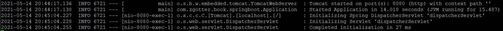
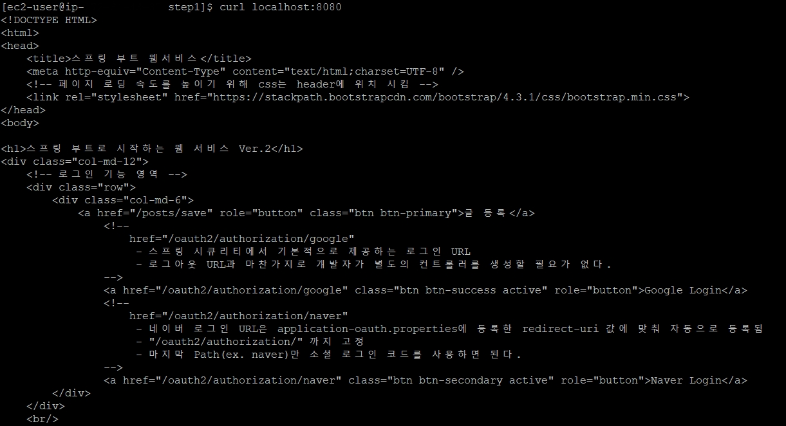

# 스프링 부트 프로젝트로 RDS 접근

## 1. RDS 스프링 부트 프로젝트 실행 작업

- RDS의 MariaDB에서 스프링 부트 프로젝트를 실행하기 위해선 몇 가지 작업이 필요하다.  
  
  
- **테이블 생성**
  - H2에서 자동 생성해주던 테이블들을 MariaDB에선 직접 쿼리를 이용해 생성한다.  
    
  
- **프로젝트 설정**
  - 자바 프로젝트가 MariaDB에 접근하려면 데이터베이스 드라이버가 필요하다.
  - MariaDB에서 사용 가능한 드라이버를 프로젝트에 추가한다.  
    
  
- **EC2(리눅스 서버) 설정**
  - 데이터베이스의 접속 정보는 중요하게 보호해야 할 정보이다.
  - 프로젝트 안에 접속 정보를 갖고 있다면 깃허브와 같이 오픈된 공간에선 누구나 해킹할 위험이 있다.
  - EC2 서버 내부에서 접속 정보를 관리하도록 설정한다.
    

<br>

### 1.1 테이블 생성

- 생성할 테이블 종류 (2가지)
  - JPA가 사용될 엔티티 테이블
  - 스프링 세션이 사용될 테이블
    
<br>

#### 1.1.1 JPA 사용 엔티티 테이블

- 테스트 코드 수행 시 로그로 생성되는 쿼리 사용

```
# posts
Hibernate: create table posts (id bigint not null auto_increment, created_date datetime, modified_date datetime, author varchar(255), content TEXT not null, title varchar(500) not null, primary key (id)) engine=InnoDB
```

```
# user
Hibernate: create table user (id bigint not null auto_increment, created_date datetime, modified_date datetime, email varchar(255) not null, name varchar(255) not null, picture varchar(255), role varchar(255) not null, primary key (id)) engine=InnoDB
```

<br>

#### 1.1.2 스프링 세션 테이블

- `schema-mysql.sql` 파일에서 확인 가능

```
CREATE TABLE SPRING_SESSION (
	PRIMARY_ID CHAR(36) NOT NULL,
	SESSION_ID CHAR(36) NOT NULL,
	CREATION_TIME BIGINT NOT NULL,
	LAST_ACCESS_TIME BIGINT NOT NULL,
	MAX_INACTIVE_INTERVAL INT NOT NULL,
	EXPIRY_TIME BIGINT NOT NULL,
	PRINCIPAL_NAME VARCHAR(100),
	CONSTRAINT SPRING_SESSION_PK PRIMARY KEY (PRIMARY_ID)
) ENGINE=InnoDB ROW_FORMAT=DYNAMIC;

CREATE UNIQUE INDEX SPRING_SESSION_IX1 ON SPRING_SESSION (SESSION_ID);
CREATE INDEX SPRING_SESSION_IX2 ON SPRING_SESSION (EXPIRY_TIME);
CREATE INDEX SPRING_SESSION_IX3 ON SPRING_SESSION (PRINCIPAL_NAME);

CREATE TABLE SPRING_SESSION_ATTRIBUTES (
	SESSION_PRIMARY_ID CHAR(36) NOT NULL,
	ATTRIBUTE_NAME VARCHAR(200) NOT NULL,
	ATTRIBUTE_BYTES BLOB NOT NULL,
	CONSTRAINT SPRING_SESSION_ATTRIBUTES_PK PRIMARY KEY (SESSION_PRIMARY_ID, ATTRIBUTE_NAME),
	CONSTRAINT SPRING_SESSION_ATTRIBUTES_FK FOREIGN KEY (SESSION_PRIMARY_ID) REFERENCES SPRING_SESSION(PRIMARY_ID) ON DELETE CASCADE
) ENGINE=InnoDB ROW_FORMAT=DYNAMIC;
```

<br>

### 1.2 프로젝트 설정

#### 1.2.1 MariaDB 드라이버 `build.gradle` 등록

```
compile("org.mariadb.jdbc:mariadb-java-client")
```

<br>

#### 1.2.2 `application-real.properties` 파일 생성

- 서버에서 구동될 환경 구성
- 파일 경로 : `src/main/resources`
- 해당 파일을 만들면 `profile=real`인 환경이 구성된다.
- 실제 운영될 환경이기 때문에 보안/로그상 이슈가 될 만한 설정들을 모두 제거하며 RDS 환경 profile 설정이 추가된다.

<br>

### 1.3 EC2 설정

#### 1.3.1 `application-real-db.properties` 파일 생성

- OAuth와 마찬가지로 RDS 접속 정보도 보호해야 할 정보이다.
- 그러므로 EC2 서버에 직접 설정 파일을 둔다.
- `app` 디렉토리에 `application-real-db.properties` 파일을 생성한다.

```
vim ~/app/application-real-db.properties
```

<br>

#### 1.3.2 `application-real-db.properties` 파일 내용 추가

```
spring.jpa.hibernate.ddl-auto=none
spring.datasource.url=jdbc:mariadb://rds주소:포트명(기본:3306)/database이름
spring.datasource.username=db계정
spring.datasource.password=db계정 비밀번호
spring.datasource.driver-class-name=org.mariadb.jdbc.Driver
```

<br>

```
spring.jpa.hibernate.ddl-auto=none
```

- JPA로 테이블이 자동 생성되는 옵션을 `None`으로 지정
- RDS에는 실제 운영으로 사용될 테이블이니 절대 스프링 부트에서 새로 만들지 않도록 해야 한다.

<br>

#### 1.3.3 `deploy.sh` 내용 수정

- `deploy.sh`에서 real-db profile을 쓸 수 있도록 아래와 같이 내용을 수정한다.

```
#!/bin/bash

...

nohup java -jar \
        -Dspring.config.location=classpath:/application.properties,/home/ec2-user/app/application-oauth.properties,/home/ec2-user/app/application-real-db.properties,classpath:/application-real.properties \
        -Dspring.profiles.active=real \
        $REPOSITORY/$JAR_NAME 2>&1 &
```

<br>

```
-Dspring.profiles.active=real
```

- `application-real.properties` 활성화
- `application-real.properties` 의 `spring.profiles.include=ouath,real-db` 옵션 때문에 `real-db` 역시 함께 활성화 대상에 포함된다.

<br>

#### 1.3.4 `deploy.sh` 실행 및 정상 실행 로그 확인

```
./deploy.sh
```

```
vim nohup.out
```



- 위와 같은 내용의 로그가 보이면 성공적으로 수행된 것이다.

<br>

#### 1.3.4 `curl` 명령어를 통한 실행 확인

- `curl` 명령어를 사용하여 정상적으로 요청한 데이터가 수신되는 지 확인
- 다음 명령어 실행 시 HTML 코드가 표출되면 정상적으로 동작하는 것이다.

```
curl localhost:8080
```

