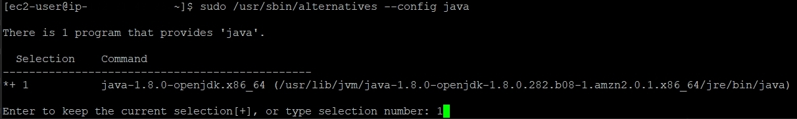
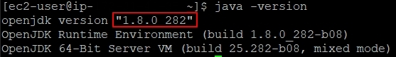
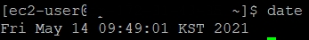
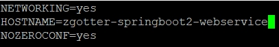
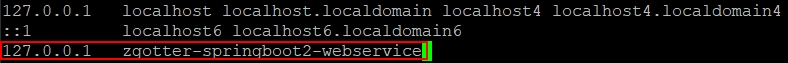
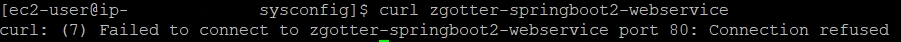

# AWS EC2 아마존 리눅스 서버 생성 시 필요한 설정들

## 1. Java 8 설치

- 현재 프로젝트의 버전 : Java 8

<br>

### 1.1 EC2에 Java 8를 설치

```
sudo yum install -y java-1.8.0-openjdk-devel.x86_64
```

<br>

### 1.2 인스턴스의 Java 버전 8로 변경

- 다음 명령어 실행 시 아래와 같은 선택 화면이 표출된다.
- 여기서 설치한 Java 8을 선택한다.

```
sudo /usr/sbin/alternatives --config java
```



<br>

### 1.3 사용하지 않는 Java 버전 삭제

- 필요 없는 Java 버전을 삭제하고 싶을 땐 다음 명령어를 사용하면 된다.

```
sudo yum remove java-1.x.x-openjdk
```

<br>

### 1.4 현재 Java 버전 확인

```
java -version
```



<br>

## 2. 타임존 변경

- 기존 서버의 시간 : 미국 시간대
- 한국 시간대가 되어야만 우리가 사용하는 시간이 모두 한국 시간으로 등록되고 사용됨  
  
  
- EC2 서버의 기본 타임존은 UTC이다.
- UTC는 세계 표준 시간으로 한국의 시간과는 9시간 차이가 발생한다.

<br>

### 2.1 서버의 타임존을 한국 시간(KST)로 변경

```
sudo rm /etc/localtime
sudo ln -s /usr/share/zoneinfo/Asia/Seoul /etc/localtime
```

<br>

### 2.2 타임존 변경 확인

- `date` 명령어로 타임존이 KST로 변경된 것 확인

```
date
```




<br>

## 3. 호스트네임 변경

- 현재 접속한 서버의 별명을 등록
- IP만으로 어떤 서버가 어떤 역할을 하는 지 알 수 없음
- 이를 구분하기 위해 호스트 네임을 필수로 등록함

<br>

### 3.1 `network` 파일 열기

```
sudo vim /etc/sysconfig/network
```

<br>

### 3.2 호스트네임(`HOSTNAME`) 변경

- 화면에서 노출되는 항목 중 `HOSTNAME`으로 되어있는 부분을 원하는 서비스명으로 변경한다.



<br>

### 3.3 저장 후 파일 닫기

```
!wq
```

<br>

### 3.4 서버 재부팅

```
sudo reboot
```

<br>

### 3.5 `hosts` 파일 열기

```
sudo vim /etc/hosts
```

<br>

### 3.6 `hosts` 파일에 `HOSTNAME` 등록



<br>

### 3.7 저장 후 파일 닫기

```
!wq
```

<br>

### 3.8 정상 등록 확인

- 다음 명령어를 실행하여 정상적으로 등록되었는 지 확인한다.
- 명령어 실행 시 "80 포트로 접근이 안된다"는 에러가 발생하면 등록에 성공한 것이다.
  - 아직 80포트로 실행된 서비스가 없음을 의미한다.
  - 즉, `curl 호스트 이름`으로 실행은 잘 되었음을 의미한다. 

```
curl zgotter-springboot2-webservice
```

