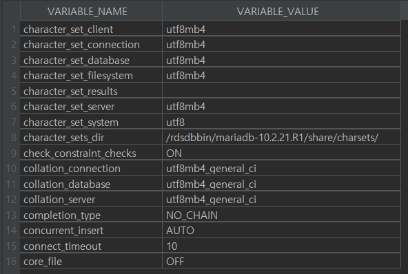
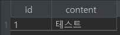

# AWS RDS 로컬 연결 시 설정 필요 사항들

## 1. 쿼리가 수행될 database 선택

```sql
use zgotter_springboot2_webservice;
```

## 2. character set 설정

### 2.1 현재의 character_set, collation 설정 확인

```sql
show variables like 'c%';
```

### 2.2 character set 변경

```sql
ALTER DATABASE zgotter_springboot2_webservice
CHARACTER SET = 'utf8mb4'
COLLATE = 'utf8mb4_general_ci';
```

### 2.3 변경 결과 확인

```sql
show variables like 'c%';
```



## 3. 타임존 확인
select @@time_zone, now();


## 4. 한글 확인용 테이블 생성 및 데이터 입력

```sql
CREATE TABLE test (
id  bigint(20) NOT NULL AUTO_INCREMENT,
content varchar(255) DEFAULT NULL,
PRIMARY KEY (id)
) ENGINE=InnoDB;
```

```sql
INSERT INTO test(content) values ('테스트');
```

```sql
select * from test;
```

