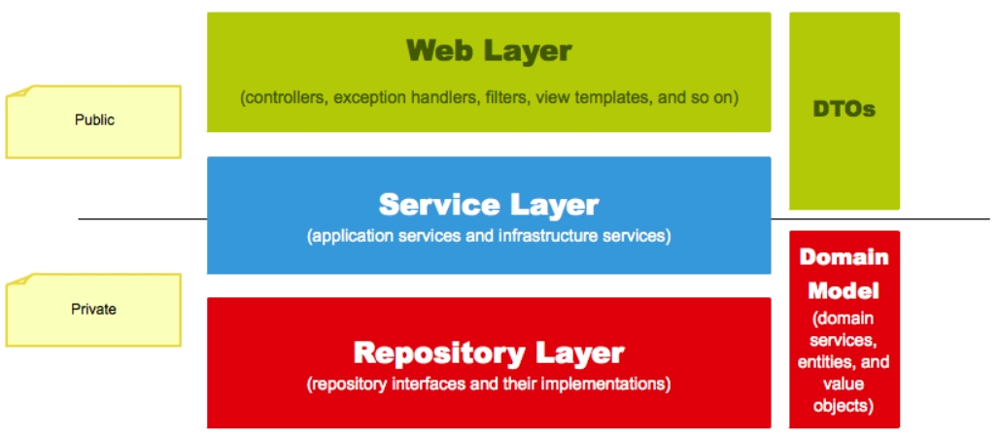

# Spring 웹 계층

## Web Layer

- 흔히 사용하는 컨트롤러(`@Controller`)와 JSP/Freemarker 등의 뷰 템플릿 영역
- 외부 요청과 응답에 대한 전반적인 영역을 이야기한다.
  - 필터(`@Filter`), 인터셉터, 컨트롤러 어드바이스(`@ControllerAdvice`)
    
 

## Service Layer

- `@Service`에 사용되는 서비스 영역
- 일반적으로 Controller와 Dao의 중간 영역에서 사용됨
- `@Transactional`이 사용되어야 하는 영역이기도 함
- **트랜잭션과 도메인 간의 순서만 보장**

 

## Repository Layer

- Database와 같이 데이터 저장소에 접근하는 영역
- Dao(Data Access Object) 영역으로 이해하면 쉬움

 

## Dtos

- Dto(Data Transfer Object) : 계층 간에 데이터 교환을 위한 객체
- Dtos : Dto들의 영역
- ex) 뷰 템플릿 엔진에서 사용될 객체나 Repository Layer에서 결과로 넘겨준 객체 등

 

## Domain Model

- 도메인이라 불리는 개발 대상을 모든 사람이 동일한 관점에서 이해할 수 있고 공유할 수 있도록 단순화시킨 것
- ex) 택시 앱의 도메인
  - 배차, 탑승, 요금 등
- `@Entity`가 사용된 영역 또한 도메인 모델이다.
- 다만, 무조건 데이터베이스의 테이블과 관계가 있어야만 하는 것은 아니다.
  - VO처럼 값 객체들도 이 영역에 해당하기 때문
- **비지니스 처리를 담당하는 곳**